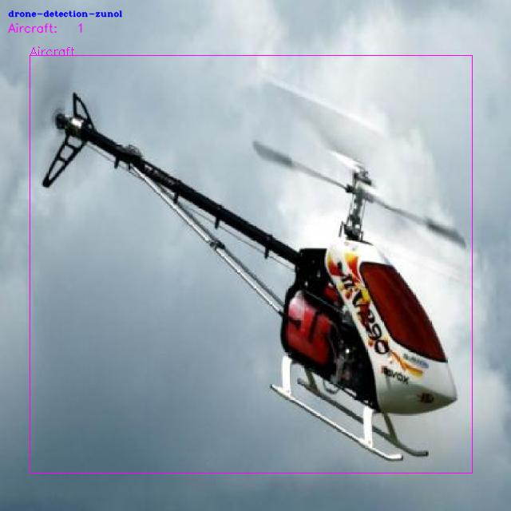
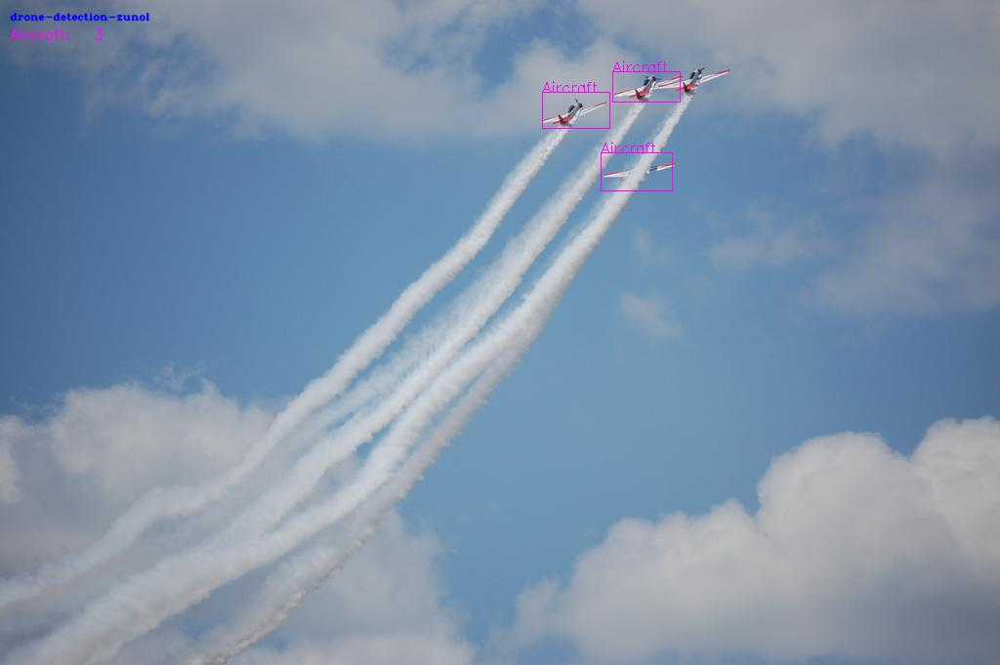
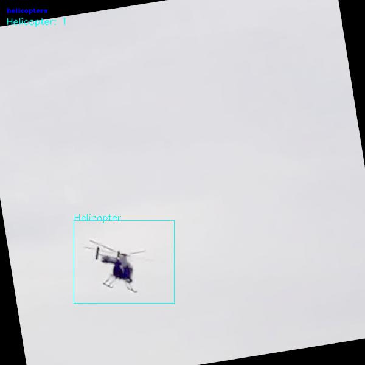
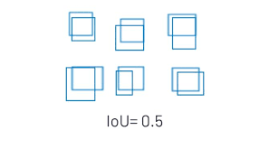
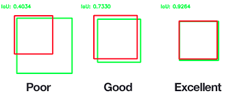
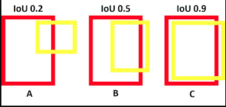
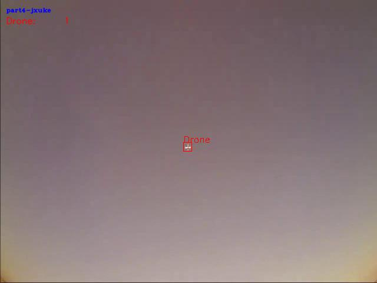
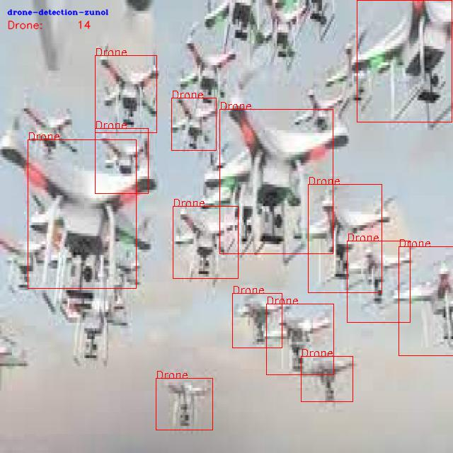
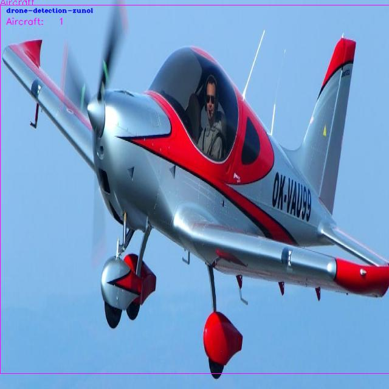

# find_wrong_labels_manually
Daha önce labellanmış bir datasetin temizliği yapılırken dikkat edilmesi gereken hususlar.

## Datasette bulunan hata türlerinin model eğitimine etkisi

### !!!!!!!!!!!!! Yanlış Label:
Yanlış labellanmış (drone yerine helikopter, kuş yerine uçak...) resimlerin datasette bulunması, modelin kendini eğitirken en büyük engel sayılabilir ve modelin gerçek performansının ölçülememesine yol açar.\
\
Yanlış label örneği:\

### !!!!!!!!!!! Eksik Label
Eksik labellar, model doğru tahmin yapmasına rağmen ona yanlış yaptığını düşündürüp modelin performansını oldukça düşürmekte ve modelin gerçek performansının ölçülememesine yol açmakta.\
\
Eksik label örneği:\

### !!!!!!!!! Geniş label
Olması gerekenden daha geniş labellar, gerçek resimle alan farkının ne kadar büyük olmasına bağlı olarak modelin daha isabetli tahminler yapmasını çok zorlaştırmakta ve özellikle mAP 0.5-0.95 değerini olduğundan daha düşük göstermekte.\
\
Geniş label örneği:\

IoU değeri (kesişim alanı bölü birleşim alanı) KESİNLİKLE 0.5 altına düşmemeli.\
Yani yapılabilecek en iyi tahmin ile resimdeki label arasındaki IoU oranı 0.5 den yüksek olmalı.\
\
Örnek IoU değerleri:\
.
.
.
### !!!!! Ayırt etmesi zor
Eğer bir insan label'a baktığında kuş mu, uçak mı, drone mu yoksa süperman mi ayırt etmekte çok zorlanıyorsa ve "Bu yüksek ihtimalle drone'dur ya" diyemiyorsa, bu tarz labellar modelin sınıflar arası ayrım yapabilme yeteneğini azaltmakta.\
Not: Eğer yapılan modeldeki asıl amaç bir sınıfı öncelikli olarak tespit etmekse ve bu sınıf olduğundan emin olunamayan labellar bulunuyorsa bunlar datasete dahil edilebilir.\
\
Ayırt etmesi zor label örneği:\

### !!!! Fazla karışık
Bu tarz resimler eğer tamamen doğru labellanmışsa amacına bağlı olarak modeli biraz geliştirebileceği gibi, modelin çoğunlukla karşılaşacağı senaryolarda performansını ve confidence'ını azaltır.\
Not: Bu aşamada modelin karşılaşacağı senaryoların kompleks olup olmayacağı önem taşır.\
\
Fazla karışık label örneği:\

### !! Çok sentetik resimler
Eğer yapay olarak oluşturulmuş resim örnekleri, gerçekten uzaklaşmışsa ve modelin karşılaşacağı senaryolardan farklı gözüküyorsa datasete tercihen konulmamalıdır.\
\
Çok sentetik resim örneği:\

